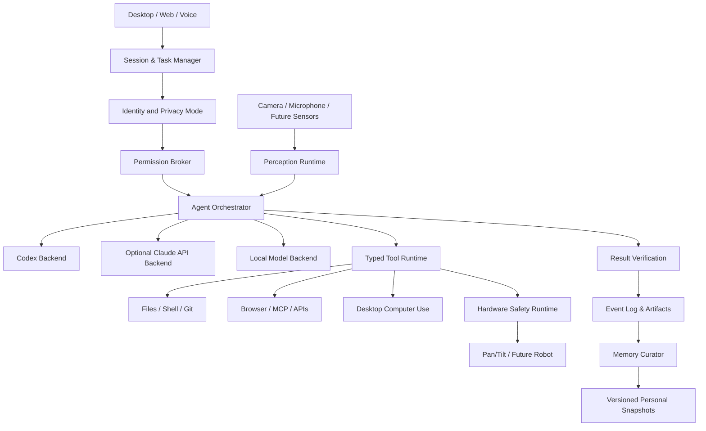

# PAIStation

**A local-first operating system for professional AI agents, computer control, voice, and versioned digital selves.**

> **Status:** public concept and architecture draft. The implementation is still private while the security boundary, provider integrations, and data model are being validated.

PAIStation is an attempt to build one dependable personal agent that can:

- work on real software projects with the discipline of modern coding agents;
- use files, terminals, browsers, and desktop applications;
- perceive the physical world through cameras and microphones, and control a safe robotic body;
- communicate naturally by text and voice;
- run local models by default, with optional external API adapters that never activate silently;
- preserve private, dated snapshots of a person's memories, language, values, and decision style.

This is not a chatbot with hundreds of loosely connected tools. It is a supervised agent runtime with explicit permissions, verifiable execution, durable memory, and replaceable intelligence backends.

## Why this project

Today's strongest assistants are split across separate products. Coding agents understand repositories but are not a persistent personal presence. Voice assistants are easy to talk to but weak at long-running work. Computer-use agents can click through interfaces but are difficult to trust. Memory features usually flatten a changing person into one continuously overwritten profile.

PAIStation brings these capabilities under one user-owned control plane.

The long-term experiment is inspired by the Ship of Theseus: instead of creating one synthetic personality that constantly rewrites itself, PAIStation preserves immutable snapshots. A future user should be able to speak with a transparent reconstruction of their 2026, 2036, or 2056 self without later beliefs silently replacing earlier ones.

## Product modes

### Operator

A professional work agent for repositories, research, documents, browser workflows, and desktop tasks. Every run has a goal, scope, permission budget, success criteria, and evidence of completion.

### Companion

A private conversational presence with its own identity and relationship history. It can know the owner deeply without pretending to be the owner.

### Time Capsules

Dated reconstructions of the owner, built from source-backed memories, recordings, writing, decisions, and explicit self-descriptions. A Time Capsule always discloses that it is a reconstruction and never invents unsupported biography.

These modes may share infrastructure, but they never share identity implicitly.

### Embodied Agent

A physical presence that can see, hear, orient itself, and eventually move through the world. The private prototype already includes a USB camera, microphone, an Arduino-controlled two-axis pan/tilt mount, and face-tracking software. The same contracts are designed to grow toward depth sensors, a mobile base, manipulators, and other robot hardware without coupling the agent to one device.

## Architecture



### The important boundary

Models propose actions. Deterministic code validates and executes them.

No model receives direct, unrestricted access to the machine. The permission broker decides whether an action is read-only, reversible, external, or destructive. Untrusted content from websites, email, documents, and screenshots is treated as data and cannot grant itself more authority.

## Codex, Claude, and local models

PAIStation separates the agent harness from the inference provider. The first production target is a single owner on one Windows workstation, fully usable with local models and no network. External APIs are optional BYOK adapters in a separate, explicit data-egress zone.

The first local professional path under evaluation is the open Codex App Server harness connected to LM Studio. This can provide threads, resumable turns, approvals, event streaming, and tool orchestration locally; actual planning quality still depends on the selected local model and must pass PAIStation's own evals.

### Codex adapter

- Rich product integration through the [Codex App Server](https://learn.chatgpt.com/docs/app-server), including a local LM Studio provider path.
- Programmatic coding tasks through the [Codex SDK](https://learn.chatgpt.com/docs/codex-sdk).
- Reuses Codex concepts such as threads, streamed events, approvals, sandboxing, and resumable work.

### Claude adapter

- Optional BYOK agent execution through the official Claude Agent SDK.
- Anthropic API credentials are never required for the local core product.
- Managed Agents and direct Messages API integrations are later opt-in cloud adapters, not automatic fallbacks.

### Local adapter

- OpenAI-compatible endpoints such as LM Studio, vLLM, or llama.cpp servers.
- Local inference for sensitive memory, offline conversations, embeddings, routing, and low-cost tasks.
- Model loading and VRAM budgeting are handled by a dedicated model manager.

Provider integrations must use supported authentication flows. PAIStation will not proxy, scrape, or bypass consumer product access. Users connect their own accounts, API credentials, or local runtimes where required.

## Model selection without provider chaos

The default interface should offer three choices, not a wall of model IDs:

1. **Auto local** — choose only among locally installed, eval-qualified backend/model pairs.
2. **Choose local** — pin a specific local agent engine and model.
3. **External API** — a separate opt-in zone for BYOK providers with an explicit egress preview.

An advanced panel can expose individual models and reasoning settings.

Every backend publishes a capability manifest:

```yaml
id: codex-lmstudio
kind: agent
provider: lmstudio
capabilities: [coding, shell, git, vision, long_running]
privacy: local
supports:
  streaming: true
  resume: true
  approvals: true
  sandbox: true
limits:
  context: provider_managed
  parallel_runs: configurable
```

Before a task starts, the UI should make five things visible:

- selected backend and model;
- local or cloud processing;
- tools and data sources being granted;
- expected approval behavior;
- local fallback order; external API is never an implicit fallback.

The user can pin a backend per thread. External API fallback is disabled by default and must never cross a privacy boundary silently.

## Computer use

PAIStation follows a reliability hierarchy:

1. structured API or MCP integration;
2. filesystem, shell, or application CLI;
3. browser DOM and accessibility APIs;
4. screenshot-driven mouse and keyboard control as the final fallback.

GUI control is powerful but probabilistic. Sensitive actions require previews and explicit confirmation. On Windows, foreground computer use must also make it obvious when the agent owns the keyboard and pointer, and offer an immediate stop control.

## Embodied intelligence

PAIStation treats cameras, microphones, motors, and future robot hardware as first-class capabilities rather than ad-hoc tools.

Perception is split into two speeds:

- **Fast perception** runs continuously with conventional vision and signal processing for tracking, motion, safety zones, and low-latency reactions.
- **Semantic perception** sends selected frames or events to a vision-language model when the agent needs to understand objects, scenes, text, people, or a developing situation.

Continuous video is not continuously streamed into an LLM. A deterministic perception runtime decides when a meaningful event or representative frame should enter model context.

The embodiment layer is defined by three stable interfaces:

- `PerceptionProvider` produces timestamped observations with provenance and confidence;
- `ActuatorProvider` exposes semantic actions such as orient, follow, stop, move, or grasp;
- `SafetyController` enforces physical limits independently of model output.

The current pan/tilt station is therefore the first robot head, not a disposable demo. Future devices can be added as adapters. ROS 2 can become a bridge when the hardware grows complex enough, without making it a dependency of the initial desktop agent.

Physical safety remains below the model: calibrated limits, acceleration caps, watchdogs, collision and workspace constraints, manual takeover, and an emergency stop cannot be overridden by a prompt.

## Voice

Voice is an interface to the same task runtime, not a separate assistant.

The first production voice loop is deliberately simple:

`push-to-talk / VAD -> ASR -> task runtime -> streamed text -> TTS`

Natural interruption, echo cancellation, full duplex, and voice cloning come later. Transcripts and audio have independent retention controls. A cloned voice is never evidence that a generated statement was actually spoken by the person.

## Versioned digital selves

Continuous self-training is not the foundation. Raw life data is append-only, generated answers never become ground truth, and each snapshot has a cutoff date.

A snapshot contains:

- source-backed episodic and semantic memories;
- values, preferences, beliefs, and uncertainty;
- writing and speech style references;
- important decisions and the reasoning behind them;
- a voice model reference, when consent and data quality allow it;
- model, prompt, retrieval index, adapter, and evaluation versions;
- provenance and confidence for every claim;
- access, inheritance, deletion, and export policy.

Fine-tuning or lightweight adapters may improve style later, but identity remains portable outside model weights.

## Planned stack

| Layer | Planned technology |
|---|---|
| Agent runtime | Python 3.11+, asyncio, Pydantic |
| Local API | FastAPI, WebSocket / JSON-RPC |
| Desktop shell | Tauri 2, React, TypeScript |
| Coding backend | Codex App Server and Codex SDK |
| Optional Claude backend | Claude Agent SDK / Messages API / Managed Agents, BYOK only |
| Local inference | LM Studio and other OpenAI-compatible runtimes |
| Browser | Playwright, isolated browser profiles |
| Windows automation | UI Automation first, visual computer use as fallback |
| Voice | VAD, faster-whisper or Qwen ASR, pluggable TTS |
| Perception | OpenCV fast path, event-triggered vision-language models |
| Embodiment | Typed sensor/actuator contracts, Arduino serial today, optional ROS 2 bridge later |
| Memory | SQLite, full-text search, sqlite-vec, immutable source archive |
| Security | OS sandboxing, capability grants, secret redaction, audit log |
| Observability | Structured events, traces, replayable task runs |
| Quality | pytest, scenario evals, browser replay, hardware-in-the-loop where applicable |

The stack is intentionally modular. Provider models, speech engines, vector search, and UI surfaces can change without rewriting the permission system or personal archive.

## Production principles

- Local is the default and must work offline; every external API is an explicit opt-in capability.
- Structured tools are preferred over visual clicking.
- Fast deterministic perception is preferred over sending every camera frame to a model.
- Every consequential action is attributable and reviewable.
- Verification is part of execution, not an optional final step.
- Personal memories need provenance, confidence, consent, and deletion controls.
- A companion and a reconstruction of the owner are different identities.
- No autonomous learning from the agent's own unreviewed output.
- Physical safety constraints live below the model and cannot be prompt-overridden.
- Exportability matters: a digital legacy must survive any single model provider.

## Initial roadmap

### 0. Public architecture and snapshot protocol

Publish design decisions, threat model, provider contracts, and the first personal-snapshot schema. Begin collecting a private baseline snapshot while the software is still being built.

### 1. One production vertical slice

Complete a repository task end to end: understand the request, inspect files, edit safely, run verification, present a diff, and resume after interruption.

### 2. Backend adapters and model picker

Qualify Codex App Server with LM Studio as the first local professional path, then add optional Claude and other API adapters behind explicit privacy boundaries.

### 3. Browser, desktop, voice, and embodiment

Add computer use incrementally, beginning with structured browser and accessibility control. Add a push-to-talk voice surface to the same sessions. Connect the existing camera, microphone, and pan/tilt prototype through stable perception, actuator, and safety contracts.

### 4. Time Capsule v1

Create the first immutable, source-backed personality snapshot and a regression suite for biographical fidelity, values, style, uncertainty, and non-fabrication.

## First production target

Version 1 is deliberately owner-first and single-user. It is being designed and evaluated on one real Windows workstation before the project attempts multi-user accounts, hosted billing, family administration, or enterprise features. This keeps the first release focused on one measurable outcome: a fully offline repository task that can edit safely, verify its work, show evidence, and resume after a restart.

## What is public today

For now, this repository contains the idea and architecture only. The long-term decision is to open the complete project rather than keep an open-core split. The current private implementation will be published only after a Git-history secret and personal-data audit, dependency/license review, reproducible clean install, safe defaults, and a public threat model.

If this direction resonates with you, star the repository and open a discussion describing the one workflow you would trust a personal agent to handle every day.

## Independence

PAIStation is an independent project and is not affiliated with or endorsed by OpenAI or Anthropic. Product and company names are used only to describe optional integrations.
