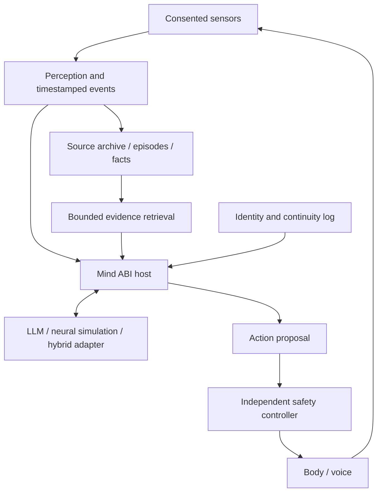

# PAIStation

**Local-first embodied memory and a research interface for interchangeable cognitive backends.**

Камера, слух, безопасное тело и память, которая переживает смену модели.

> **Direction reset: 2026-09-27.** This public repository contains a design and
> research roadmap, not a production release. Computer control is parked.
> The next target is a measured 24-hour embodied-memory demonstration.

## Proposal (October 2026)

The research and funding proposal **"The Digital Self"** — body, memory,
time-sliced selves, legacy for descendants, and the fly-to-human research program:

- English: [proposal/DIGITAL_SELF_PROPOSAL_EN.md](proposal/DIGITAL_SELF_PROPOSAL_EN.md) · [PDF](proposal/DIGITAL_SELF_PROPOSAL_EN.pdf)
- Русский: [proposal/DIGITAL_SELF_PROPOSAL_RU.md](proposal/DIGITAL_SELF_PROPOSAL_RU.md) · [PDF](proposal/DIGITAL_SELF_PROPOSAL_RU.pdf)

Author and sole developer: Alexander D. Budanov — it@alexbudanov.ru · Telegram @alexandr_budanov_it.

## The idea

Build a system that can observe an explicitly permitted environment, keep a
source-backed history, recall what happened, and act through a bounded body.
Its base model should be replaceable without discarding that history.

The owner proposed extending this into **Mind ABI**: a shared experimental
boundary for an LLM, a neural simulation, or a hybrid controller to interact
with memory and a body. The name is an architectural metaphor: v0 is a
versioned message protocol, **not** a binary ABI, consciousness format, or
claim that arbitrary brains can be plugged in unchanged.

The useful research question is concrete: *what changes when different
controllers receive the same observations and act in the same environment?*
This is a hypothesis to test, not a proven breakthrough or priority claim.

## Three cores, one optional research lane

| Core | Role |
|---|---|
| Body | Camera, microphone, voice and a safely bounded two-axis head |
| Memory | Timestamped events, episodes, evidence-backed facts and corrections |
| Identity and cognition | Explicit identity, replaceable inference, versioned state and later curated personalization |
| Fly Lab (optional) | Small, isolated sensorimotor experiments using fly-inspired or connectome-constrained models |

The fast control loop does not wait for an LLM. Models propose actions; a
separate controller enforces freshness, calibrated limits, watchdogs and STOP.
No experimental backend receives direct motor, shell or private-archive access.

## Keep these concepts separate

- **Identity:** whose instance this is, its role, declared traits and representation limits.
- **Memory:** evidence and its derived, correctable interpretations.
- **Cognitive state:** backend-specific transient state or checkpoint.
- **Model/connectome:** a versioned processing mechanism, not a biography.
- **Embodiment:** sensor and actuator capabilities and their calibrated constraints.
- **Continuity log:** recorded transitions, gaps, restarts, forks and provenance.

A companion, an owner reconstruction and a fly simulation are distinct
identities. Sharing a body or memory protocol does not merge them. Replacing
weights or a backend may reset cognitive state; that transition must be visible.

## Milestones, not inflated percentages

1. **M0 — Contract and scope:** an embodied-only profile, event schema and replay tests.
2. **M1 — Reliable observation:** explicit gaps, recovery, storage budget and separate motor safety acceptance.
3. **M2 — 24 hours:** actual sustained operation, consolidation and next-day recall with sources.
4. **M3 — 30 days:** temporal facts, tested portable recovery and base-model replacement without losing history.
5. **M4 — Personalization:** evaluated snapshots and optional small adapters trained on separately consented, curated examples.

None of these new end-to-end milestones is reported as passed yet.
The private prototype has reusable capture, encrypted archive, consent and
bounded-control components; raw recordings are not yet episodic memory.
Hardware and software must be requalified for this new scope.

Details: [roadmap](ROADMAP.md), [Mind ABI v0 proposal](MIND_ABI.md),
[Fly Lab and primary sources](FLY_LAB.md).

## Why a fly?

Fly neuroscience offers accessible wiring data, executable neural models and
embodied simulators. They are different layers, not one ready-made mind.
Our first candidate experiment is visual attention in simulation, compared
against a simple conventional controller. It is independent of the memory
milestones. The [Fly Lab note](FLY_LAB.md) records limitations and licensing.

A future human neural reconstruction, if sufficiently characterized and
available, would still require a new scientific model, sensor/body mappings,
state semantics and validation. A common API does not solve those problems.
This project does **not** claim consciousness transfer, biological equivalence,
literal immortality, or a faithful copy of a person.

## User ownership and data boundaries

Local inference and local private data are the default. Capture, retention,
movement, speech, training and export are separate decisions. Collection does
not authorize training or publication. Other people's recordings require
appropriate consent and exclusion controls; a camera cannot infer consent.

Memory keeps source links, uncertainty and correction history. Generated text
is never silently promoted to a biographical fact. Deletion/withdrawal must
propagate to derived indexes, summaries and affected training artifacts.
Affected trained adapters must be disabled pending a reviewed replacement;
deleting a source file does not erase its influence from model weights.

The user must be able to pause observation, stop movement independently of the
model, and save and exit with an explicit checkpoint or a visible error.
Unbounded raw recording is not the storage strategy.

## What is parked

Desktop automation, browser journeys, coding agents, application launching and
provider expansion are no longer release prerequisites. Existing work is
preserved, not deleted. The new runtime profile must not expose those tools.

## Publication and licensing status

This is a public **concept repository**. It contains no private recordings,
owner archive, credentials, identity dataset or trained personal model. The
implementation remains private pending a scoped source release, privacy review,
dependency review and an explicit license decision. Public visibility alone
does not grant an open-source license; this update does not relicense code or
third-party data. The previous concept remains in Git history.

Independent research project; not affiliated with the neuroscience projects
referenced here. Contributions to methodology and reproducible evaluations are
welcome; please do not upload personal data to issues.
